# Customer Churn Classification: Predicting Customer Attrition with Machine Learning

## Overview

This project builds and evaluates machine learning classification models to predict customer churn.

The goal is not only to classify customers, but also to evaluate churn risk using business-relevant metrics, analyze decision thresholds, and generate retention recommendations.

---

## Business Context

Customer churn occurs when customers stop using a company’s service.

For subscription-based businesses, churn prediction can help prioritize retention campaigns, reduce revenue loss, and improve customer lifetime value.

In churn prediction, accuracy alone is not enough. A model can achieve high accuracy by predicting the majority class while failing to detect customers who are likely to churn.

This project focuses on the business trade-off between:

- capturing as many churners as possible,
- avoiding excessive false positives,
- matching the decision threshold to retention team capacity.

---

## Dataset

This project uses the **Telco Customer Churn** dataset from Kaggle.

The dataset contains customer account, service, contract, billing, and churn information.

Main variables include:

- `customerID`: customer identifier.
- `tenure`: number of months the customer has stayed with the company.
- `Contract`: contract type.
- `InternetService`: type of internet service.
- `OnlineSecurity`: whether the customer has online security.
- `TechSupport`: whether the customer has tech support.
- `PaymentMethod`: payment method.
- `MonthlyCharges`: monthly billed amount.
- `TotalCharges`: accumulated charges.
- `Churn`: target variable.

The binary modeling target is:

```text
ChurnLabel
```

where:

| Label | Meaning |
|---:|---|
| 0 | No churn |
| 1 | Churn |

> Note: Raw Kaggle data files are not included in this repository. Users must download the dataset manually and place `telco_customer_churn.csv` inside `data/raw/`.

---

## Project Structure

```text
customer-churn-classification/
├── data/
│   ├── raw/
│   └── processed/
├── models/
├── notebooks/
│   └── 01_churn_classification.ipynb
├── reports/
│   ├── executive_summary_en.md
│   ├── resumen_ejecutivo_es.md
│   ├── model_metrics.csv
│   ├── cross_validation_summary.csv
│   ├── final_model_evaluation.csv
│   ├── threshold_recommendation.csv
│   └── figures/
├── src/
│   ├── audit_data.py
│   ├── cross_validate_models.py
│   ├── evaluate_models.py
│   ├── interpret_model.py
│   ├── load_data.py
│   ├── preprocess_data.py
│   ├── threshold_analysis.py
│   └── train_models.py
├── README.md
├── requirements.txt
└── .gitignore
```

---

## Methodology

The project follows a reproducible machine learning workflow:

1. Load raw churn data.
2. Audit target distribution, missing values, data types, and business signals.
3. Clean `TotalCharges` and create a binary churn target.
4. Create stratified train and validation splits.
5. Preprocess numerical and categorical variables.
6. Train multiple classification models.
7. Compare models using ROC-AUC, Average Precision, F1-score, precision, and recall.
8. Validate model stability with stratified cross-validation.
9. Analyze decision thresholds for retention strategy.
10. Evaluate the final model with confusion matrices, ROC curve, and Precision-Recall curve.
11. Interpret churn drivers using feature importance and logistic regression coefficients.

---

## Data Quality Summary

The dataset has:

| Check | Result |
|---|---:|
| Rows | 7,043 |
| Columns | 21 |
| Duplicate rows | 0 |
| Duplicate customer IDs | 0 |
| Churn rate | 26.54% |
| No churn rate | 73.46% |

The main data quality issue was `TotalCharges`.

`TotalCharges` was stored as text and contained 11 blank values. All blank values occurred when `tenure = 0`, meaning those customers had no accumulated charges yet.

The cleaning rule was:

```text
Blank TotalCharges values with tenure = 0 → TotalCharges = 0
```

---

## Target Distribution

The churn problem has moderate class imbalance:

| Class | Share |
|---|---:|
| No churn | 73.46% |
| Churn | 26.54% |

A naive model that always predicts “No churn” would achieve 73.46% accuracy while detecting zero churners. For this reason, accuracy is not treated as the main success metric.

---

## Initial Business Signals

The audit revealed strong churn patterns:

| Segment | Churn Rate |
|---|---:|
| Month-to-month contract | 42.71% |
| Two-year contract | 2.83% |
| Fiber optic internet service | 41.89% |
| Electronic check payment | 45.29% |
| No OnlineSecurity | 41.77% |
| No TechSupport | 41.64% |
| Paperless billing enabled | 33.57% |

These patterns suggest that churn is associated with contract type, service type, support/security add-ons, and payment behavior.

---

## Models Compared

| Model | Purpose |
|---|---|
| Most frequent baseline | Minimum benchmark |
| Logistic Regression | Interpretable linear classifier |
| Decision Tree | Simple nonlinear classifier |
| Random Forest | Ensemble classifier |
| Gradient Boosting | Boosted ensemble classifier |

---

## Validation Results at Threshold 0.50

At the default threshold of 0.50, Gradient Boosting achieved the strongest ranking performance.

| Model | Accuracy | Precision | Recall | F1 | ROC-AUC | Average Precision |
|---|---:|---:|---:|---:|---:|---:|
| Gradient Boosting | 0.8048 | 0.6689 | 0.5241 | 0.5877 | 0.8442 | 0.6631 |
| Random Forest | 0.7615 | 0.5354 | 0.7674 | 0.6308 | 0.8433 | 0.6507 |
| Logistic Regression | 0.7381 | 0.5043 | 0.7834 | 0.6136 | 0.8416 | 0.6327 |
| Decision Tree | 0.7452 | 0.5131 | 0.7861 | 0.6209 | 0.8332 | 0.6230 |
| Baseline | 0.7346 | 0.0000 | 0.0000 | 0.0000 | 0.5000 | 0.2654 |

The baseline accuracy is misleading because it detects no churners.

---

## Cross-Validation Results

Cross-validation confirmed that Gradient Boosting is the strongest model for ranking churn risk.

| Model | Mean Accuracy | Mean ROC-AUC | Mean Average Precision |
|---|---:|---:|---:|
| Gradient Boosting | 0.8046 | 0.8471 | 0.6616 |
| Random Forest | 0.7657 | 0.8465 | 0.6576 |
| Logistic Regression | 0.7456 | 0.8450 | 0.6555 |
| Decision Tree | 0.7292 | 0.8306 | 0.6218 |
| Baseline | 0.7346 | 0.5000 | 0.2654 |

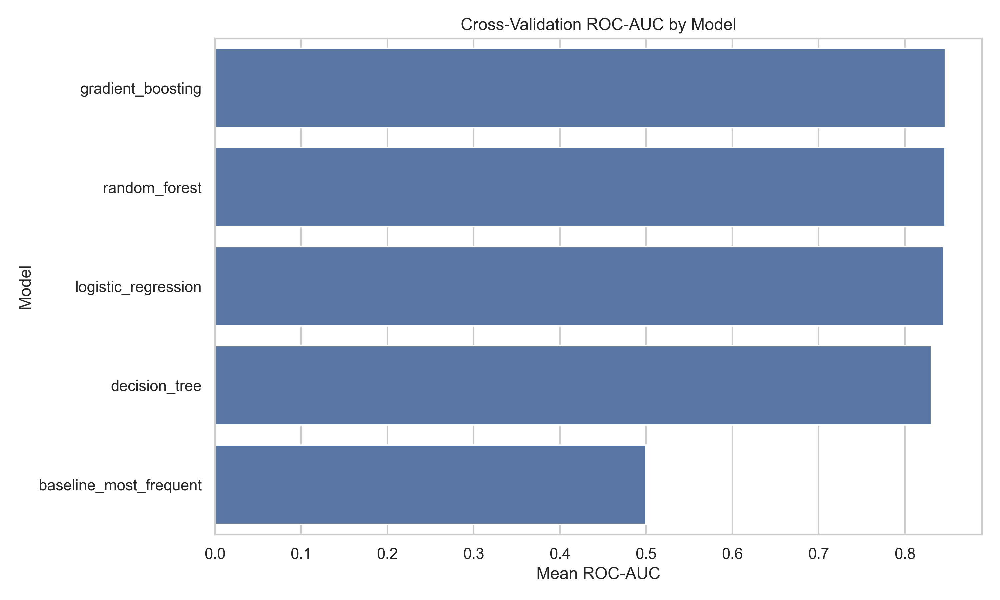

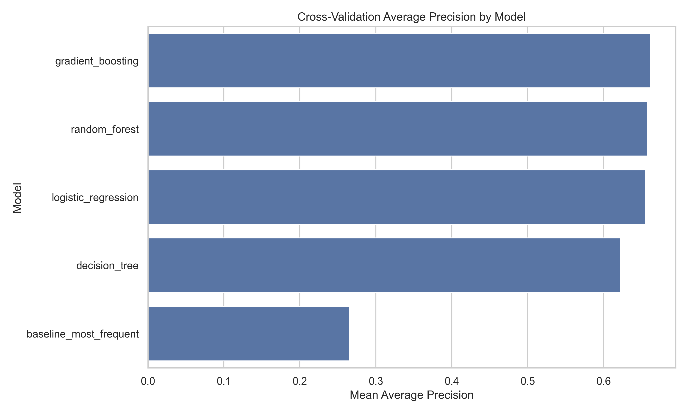

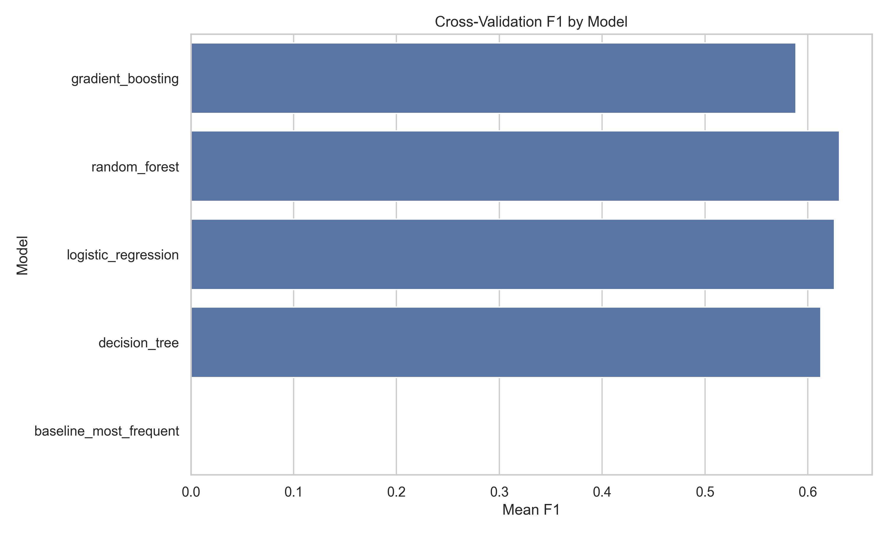

---

## Final Model

The final predictive model is:

```text
Gradient Boosting Classifier
```

The model was selected because it achieved the best cross-validation ROC-AUC and Average Precision.

---

## Threshold Analysis

The default threshold of 0.50 is not ideal for retention.

| Strategy | Threshold | Precision | Recall | Customers Flagged | Churners Captured | Churners Missed |
|---|---:|---:|---:|---:|---:|---:|
| Default | 0.50 | 0.6689 | 0.5241 | 293 | 196 | 178 |
| Balanced F1 | 0.24 | 0.5143 | 0.8182 | 595 | 306 | 68 |
| Retention Recall | 0.29 | 0.5306 | 0.7647 | 539 | 286 | 88 |
| Efficient Precision | 0.55 | 0.7046 | 0.4465 | 237 | 167 | 207 |

The recommended threshold for this project is:

```text
0.24
```

Compared with threshold 0.50, threshold 0.24:

- captures 110 additional churners,
- reduces missed churners from 178 to 68,
- increases customers flagged from 293 to 595,
- increases false positives from 97 to 289.

This is a business trade-off, not a purely technical decision.

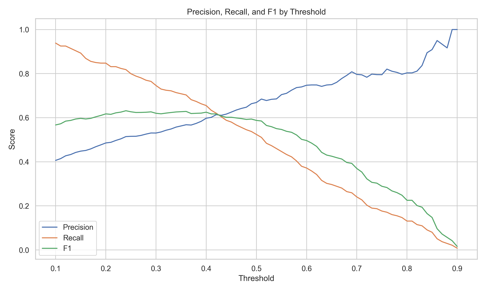

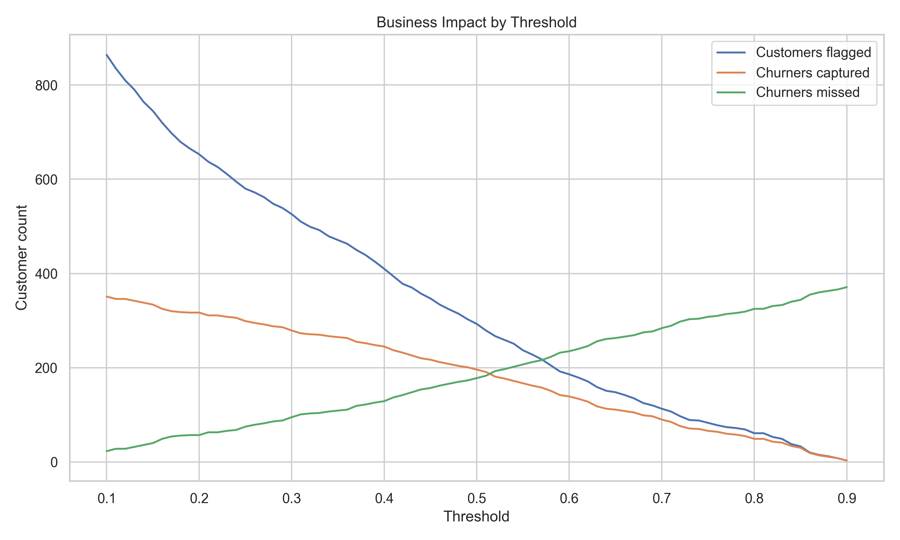

---

## Final Model Evaluation

At threshold 0.24, the model prioritizes recall for retention campaigns.

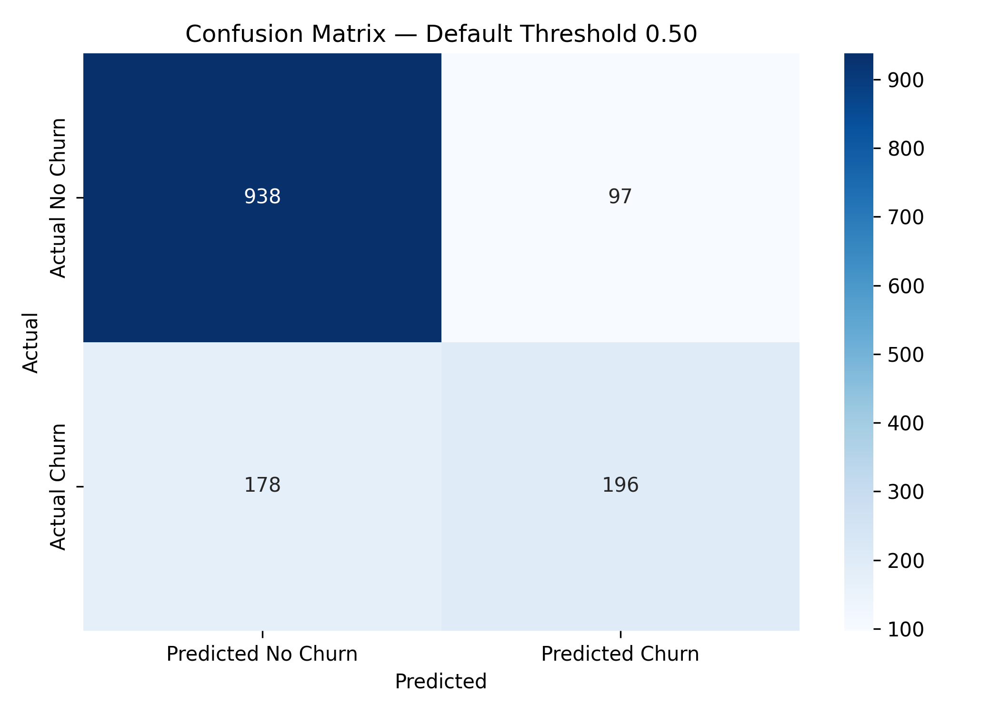

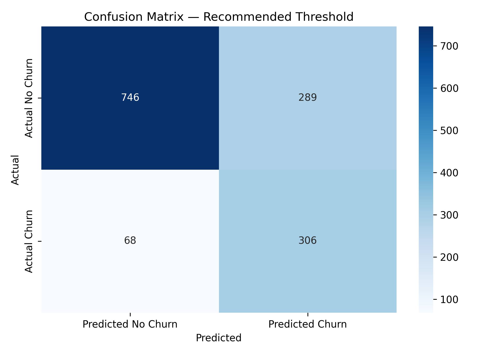

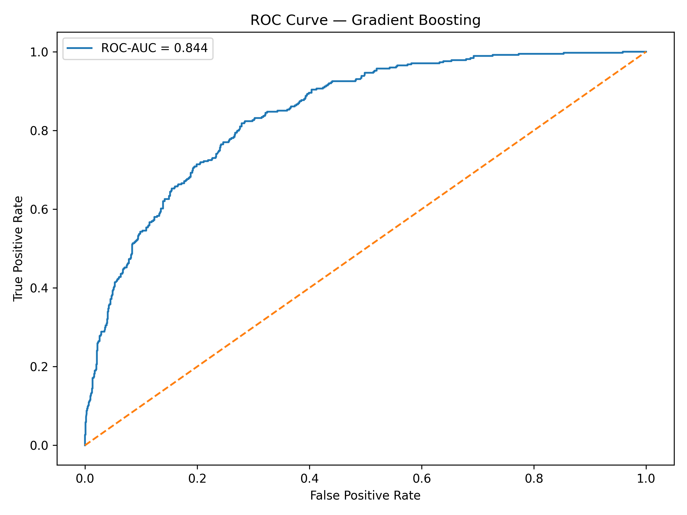

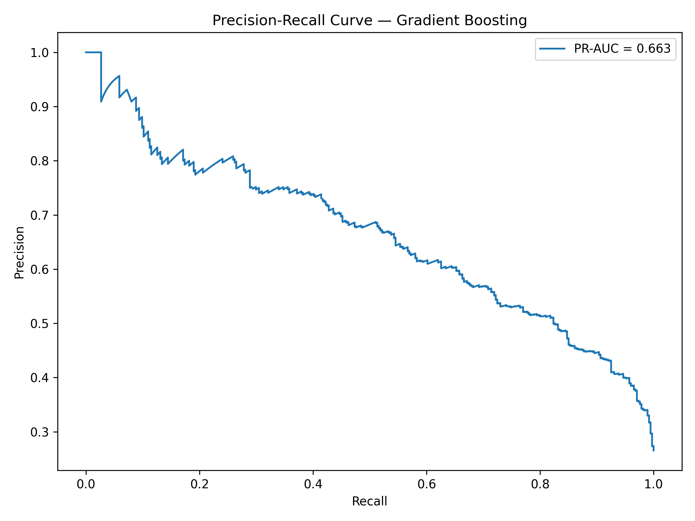

---

## Model Interpretation

Gradient Boosting feature importance shows that the most predictive features include:

- month-to-month contract,
- tenure,
- TotalCharges,
- fiber optic internet service,
- MonthlyCharges,
- no OnlineSecurity,
- no TechSupport,
- electronic check payment.

Feature importance shows which variables help prediction, but it does not directly show direction.

Logistic Regression coefficients provide directional associations.

Positive churn associations include:

- fiber optic internet service,
- month-to-month contract,
- higher TotalCharges,
- streaming services,
- electronic check payment,
- no OnlineSecurity,
- no TechSupport.

Negative churn associations include:

- longer tenure,
- two-year contract,
- DSL service,
- no internet service,
- no paperless billing,
- having dependents.

These findings should be interpreted as associations, not causal effects.

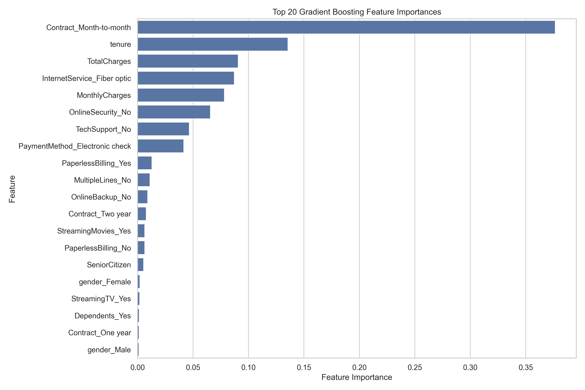

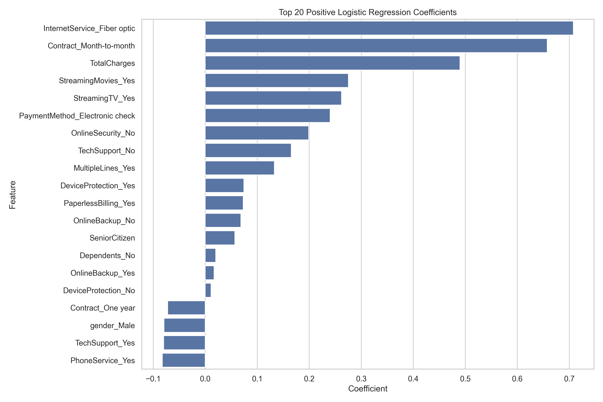

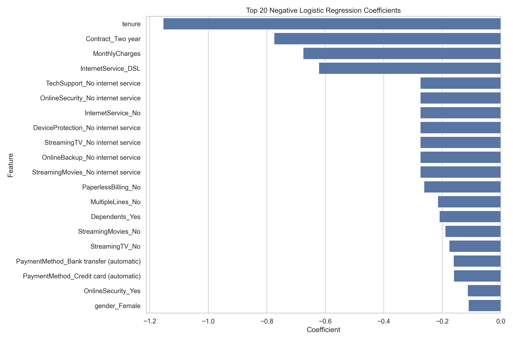

---

## Business Recommendations

1. Use the model to prioritize retention outreach, not as an automatic decision system.
2. Use threshold 0.24 when the business wants to maximize churn detection.
3. Use a higher threshold when retention capacity is limited.
4. Focus retention campaigns on month-to-month customers with short tenure and high-risk service patterns.
5. Investigate why fiber optic customers show higher churn.
6. Improve support and security offerings because lack of OnlineSecurity and TechSupport is strongly associated with churn risk.
7. Track campaign cost, retention success rate, and customer lifetime value to refine threshold selection.

---

## Reports

- [Executive Summary — English](reports/executive_summary_en.md)
- [Resumen Ejecutivo — Español](reports/resumen_ejecutivo_es.md)

---

## Notebook

- [Churn Classification Notebook](notebooks/01_churn_classification.ipynb)

---

## How to Reproduce This Project

### 1. Clone the repository

```bash
git clone https://github.com/RommelPa/customer-churn-classification.git
cd customer-churn-classification
```

### 2. Create and activate a virtual environment

```bash
py -m venv .venv
.venv\Scripts\activate
```

### 3. Install dependencies

```bash
pip install -r requirements.txt
```

### 4. Download Kaggle file

Download the Telco Customer Churn dataset from Kaggle.

Rename the CSV file as:

```text
telco_customer_churn.csv
```

Place it here:

```text
data/raw/telco_customer_churn.csv
```

### 5. Run the pipeline

```bash
python src/load_data.py
python src/audit_data.py
python src/preprocess_data.py
python src/train_models.py
python src/threshold_analysis.py
python src/evaluate_models.py
python src/interpret_model.py
python src/cross_validate_models.py
```

### 6. Open the notebook

```bash
jupyter notebook notebooks/01_churn_classification.ipynb
```

---

## Tools Used

- Python
- pandas
- numpy
- matplotlib
- seaborn
- scikit-learn
- joblib
- Jupyter Notebook
- Git
- GitHub

---

## Limitations

- The dataset is static and does not include time-based customer behavior.
- The model does not include support tickets, complaints, customer satisfaction, competitor pricing, or retention campaign history.
- Threshold selection should be adjusted using actual retention cost, customer lifetime value, and team capacity.
- Feature interpretation is associative, not causal.
- The model estimates churn probability, but it does not explain why a specific customer will churn.

---

## Next Steps

This project can be extended by:

- adding cost-sensitive threshold optimization,
- using customer lifetime value and retention campaign cost,
- calibrating predicted probabilities,
- adding SHAP explainability,
- building a dashboard for retention teams,
- deploying a churn scoring API.

---

## Spanish Summary

Este proyecto construye y evalúa modelos de clasificación para predecir abandono de clientes.

El modelo final seleccionado fue Gradient Boosting, validado con ROC-AUC y Average Precision. El umbral recomendado es 0.24, porque captura más clientes churn que el umbral estándar de 0.50 y reduce los churners perdidos de 178 a 68 en validación.

El proyecto incluye pipeline reproducible, auditoría de datos, comparación de modelos, validación cruzada, análisis de umbrales, evaluación final, interpretación de variables, notebook narrativo y reportes ejecutivos bilingües.